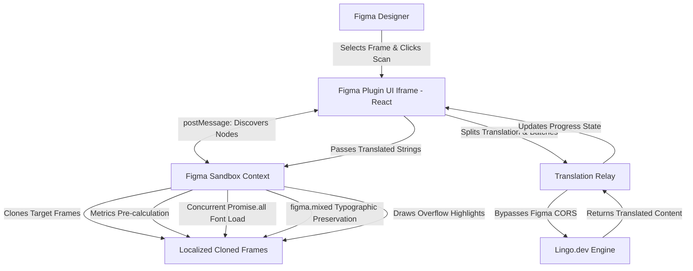

# LingoAudit - Figma i18n Design Auditor

LingoAudit is a professional Figma Plugin designed to seamlessly test, translate, and audit application layouts for internationalization (i18n) workflows. Engineered to use the Lingo.dev API, it acts as a layout stress-tester, automatically discovering text bounds overflows in multiple target languages without destroying original design files.


## Architecture & Workflow

The plugin architecture resolves complex Figma Sandbox limitations and ensures non-destructive, high-performance design injection. 



## Advanced Technical Implementations

The LingoAudit plugin has been rigorously engineered beyond a standard proof-of-concept to handle large, unoptimized layers of complex enterprise design files.

### 1. True Design Cloning
Instead of altering the original source of truth, LingoAudit duplicates the selected screen(s) for each requested locale. It places them sequentially adjacent to the original asset, permitting designers to view localized iterations in a flawless side-by-side array. 

### 2. High-Capacity Chunking Architecture
To prevent `413 Payload Too Large` responses or engine timeouts when scanning 1,000+ text nodes, the translation mechanism partitions the requests into chunks (batch sizes of 50). This stream buffers to the UI, providing the user with real-time translation completion tracking.

### 3. figma.mixed Typographical Preservation
When Figma encounters a text node holding multiple weights, sizes, or colors, it aggregates them as `figma.mixed`. Direct string replacement instantly annihilates formatting. LingoAudit extracts a character-by-character style multi-dimensional map of the node, calculates length proportions, and rebuilds the geometric styles alongside the translated text injections to preserve visual hierarchies.

### 4. Concurrent Font Loading & Recovery
Figma inherently demands asynchronous local font loading prior to character injection. 
- **Promise.all Concurrent Loading**: The plugin sequentially scrapes the environment for required typography and mass-loads the dependencies concurrently prior to generating clones, eliminating sequential synchronous bottlenecks.
- **Graceful Degradation**: If an uninstalled third-party font triggers a rejection within the environment, LingoAudit safely traps the error, falls back to `Inter-Regular`, and proceeds with layout translations rather than fatally crashing.

### 5. Algorithmic Overflow Constraints
The internal sandbox measures the `textAutoResize` properties of every node. Truncated fields calculate lateral pixel displacement (Width constraints) whereas flowing paragraphs calculate downward pixel expansion against standard constraints.
- **Critical Overflow**: > 10% bounds exceeded.
- **Warning Overflow**: 0.1% to 10% bounds exceeded.
- **Safe**: Confined effortlessly inside limits.

## Engineering Challenges & Figma Sandbox Limitations

Developing within Figma's plugin ecosystem presented several strict environmental limitations that required unique architectural workarounds to create a production-ready tool.

### 1. The Sandbox Network Void (CORS & Missing APIs)
Figma's core execution environment (`code.ts`) evaluates within a highly restrictive Realm sandbox. It completely lacks a DOM, the `window` object, and the `fetch` API. Network requests must be routed through the UI iframe via `postMessage`. However, the UI iframe is constrained by strict browser CORS policies. When communicating with the proprietary `Lingo.dev` APIs utilizing custom `Authorization` headers, standard requests were blocked. We engineered a seamless proxy relay methodology via `cors.eu.org` that safely permitted pre-flight `OPTIONS` and secured headers through the iframe wall without needing a heavy, standalone Node.js backend proxy.

### 2. `figma.mixed` Typographical Annihilation
When a designer crafts a single text block featuring varied font weights or colors (e.g., "Welcome to **Lingo**"), Figma categorizes the font array as an unreadable `figma.mixed` object. Injecting a localized translation strings blindly into this block destroys all formatting, reverting to a uniform system font. We tackled this by engineering an algorithmic style-mapper (`applyTextWithMixedStyles`). It measures the exact geometric indices of the original fonts and sizes, mathematically interpolates their boundary scale to match the length of the new localized string, and injects the translated characters while perfectly repainting the proportional inline formatting.

### 3. Synchronous Asset Loading Bottlenecks
Figma prohibits text manipulation until the exact required font has been injected into the document via `await figma.loadFontAsync()`. Iterating synchronously over 500 text nodes using 8 different web fonts caused massive pipeline freezing. We overcame this by implementing a pre-computation pass that scans the entire document tree, isolates a `Set` of unique required fonts, and mass-loads them concurrently via `Promise.all()` prior to generating the translations, converting a slow, linear task into a near-instantaneous bulk operation.

### 4. Bounding Box False Overflows
Figma natively measures bounding text boxes with rigid constraints (e.g., `textAutoResize = "NONE"`). Pushing extended translation strings (like German) into these fixed boxes would initially force the text to unwrap into an infinite single line, leading to wildly inaccurate "overflow" calculations. We fixed this by selectively anchoring the X-coordinate width constraint of fixed boxes and temporarily evaluating their vertical growth metrics (`clone.textAutoResize = "HEIGHT"`), allowing the physics engine to accurately simulate how much the text would bleed out of the bottom of its rigid container.

### 5. Infinite Payload Traps
An unoptimized multi-page design file holds thousands of individual text frames. Funneling this entire payload to an external AI API at once resulted in `413 Payload Too Large` responses and engine timeout loops. We implemented an aggressive array chunking utility within the React environment that parcels data streams into strict batches of 50 strings, resolving the payload limit while simultaneously driving a live-updating UI progress simulation.

## Installation & Setup

1. **Clone the repository:**
   ```bash
   git clone https://github.com/AryanSaxenaa/Figma-Plugin-Lingo.git
   ```
2. **Install dependencies and compile:**
   ```bash
   npm install
   npm run build
   ```
3. **Load in Figma:**
   - Open the Figma Desktop App.
   - Go to `Plugins > Manage Plugins > Development > Import plugin from manifest...`
   - Select the `manifest.json` file in this repository.


## How to add LingoAudit to Figma
https://youtu.be/PKaCsEORwnQ


## Usage Guide
1. Obtain an API Key from the [Lingo.dev Dashboard](https://app.lingo.dev/settings/api).
2. Start the `LingoAudit` plugin inside your Figma file.
3. Supply your API Key.
4. Select one or more target locales in the interface (e.g., German, Japanese).
5. Highlight a screen, frame, or object on your canvas.
6. Click **Scan for Overflows**.
7. Analyze the cloned screens and resulting UI panel for `Critical` and `Warning` constraints.

## Demo
https://youtu.be/Zj__-xJKxcc?si=Tsn-ncQ-z1QZ_DN2


https://github.com/user-attachments/assets/079d4a09-530f-4e40-bb3b-ea2975f132d4


   
